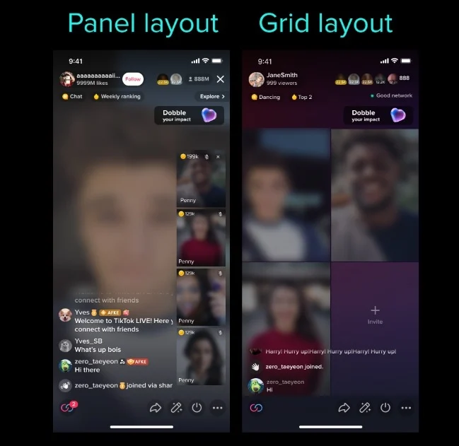
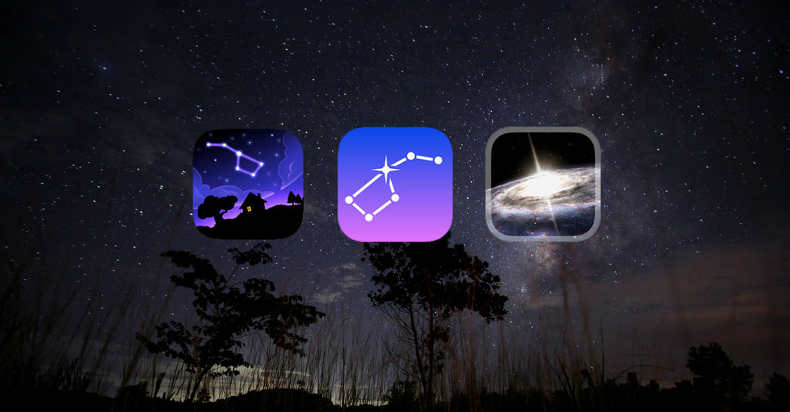

# PEC3 – Visionando el futuro con las gafas de Manovich 
## Recurso de aprendizaje de Cultura Digital

**Autor:** DIEGO GARCIA 
**Asignatura:** Cultura Digital
**Actividad:** PEC 3

---

## Planteamiento
En *El software toma el mando*, Manovich comenta que el software además de intervenir en los nuevos medios, se convierte en el **principio estructurante de la cultura digital**, lo cual hace que ya no existan medios aislados, sino **ecosistemas híbridos**, donde la imagen, el texto, la interacción entre los diferentes sistemas y algoritmos se fusionan. :contentReference[oaicite:1]{index=1}

El presente ensayo propone dos casos de hibridación **recientes y no analizados en el libro**, que ilustran cómo el software redefine formatos, sentidos y experiencias: **TikTok** y **SkyView App**. Ambos ejemplos corroboran que el software reconfigura la cultura y sobre todo, la percepción de la realidad.

---

## Re-descubriendo la hibridacion: Caso 1. TikTok

TikTok es conocido por ser plataforma de vídeos de origen chino, pero es mucho más que eso, es un medio híbrido que combina:

- **Lenguajes visuales y sonoros** (vídeo + música).  
- **Códigos textuales** (subtítulos y hashtags).  
- **Interacción social** (likes, comentarios, remixes...).  
- **Algoritmos de recomendación** que generan nuevas narrativas.

Desde la perspectiva de Manovich, TikTok no representa una colección de contenidos (videos), sino una **base de datos narrativa**, donde la experiencia del usuario se genera mediante algoritmos
en tiempo real. El orden y sentido de los contenidos no está predefinido, sino calculado intantáneamente según los patrones de consumo del usuario, intereses y mediciones de engagement. Es decir, estas métricas midan cuanto participan los usuarios, no solamente si están viendo el contenido.

TikTok por tanto es un claro ejemplo de la **fusión de medios clásicos y digitales**: La música se divide en partes, los vídeos se consumen en pequeños trozos y las historias ya no siguen un orden fijo; y el usuario, simultáneamente es espectador y también el creador. 
Las funciones de *duo* o *remix* convierten cada vídeo en un sistema reutilizable para procesos colaborativos, similar a cómo en software open source los módulos de código se comparten y reutilizan en repositorios comunitarios, al estilo de GitHub.

Basado en mi propia experiencia personal, TikTok es un ejemplo de modelo híbrido porque transforma los vídeos cortos con audio en otro proceso de creación colectiva, basada en la mezcla, reutiliación  de elementos y difusión masiva debido a los algoritmos.

---

## Re-descubriendo la hibridacion: Caso 2. SkyView App

SkyView App es una aplicación de realidad aumentada que permite **explorar el cielo nocturno superponiendo datos astronómicos sobre imágenes reales captadas por el dispositivo**. En este caso, la hibridación explicasda por Manovich ocurre entre:

- El mundo físico (el cielo real).  
- La base de datos astronómica (planetas, estrellas, constelaciones).  
- La visualización interactiva gracias sensores del dispositivo (cámara, GPS y giroscopio).  
- Interfaces intuitivas de usuario.

Aquí, el software hace de mediador entre espectador y realidad: la cámara del dispositivo no solo captura, sino que **transforma visualmente el cielo en un mapa interactivo** donde los distintos elementos del firmamento adquieren nombres, etiquetas y rutas. Éstas rutas te llevan de un elemento del cielo a otro, donde se enlazan para una mejor localización y comprensión 

Desde la óptica de Manovich, SkyView supera la simple visualización digital: es un medio híbrido donde la realidad física y la representación científica del mapa del cielo se unenn. No se trata de un mapa fijo, como si fuera un atlas mundial, sino de un **espacio aumentado** donde el usuario navega y aprende a partir de una **interfaz interactiva basada en datos**.

Además este tipo de hibridación modifica la percepción del espacio y aumenta su conocimiento ya que integra los sensores físicos propioos de los teléfonos móviles con bases de datos y la visualización digital. Por tanto este software crea una experiencia que modifica la forma en que habitualmente entendemos, conocemos y nos relacionamos con el espacio.

Personalmente soy moderadamente aficionado a la astronomía, y durante muchos años, ocasionalmente, he utilizado telescopios y mapas astronómicos para observar el cielo. Garantizo que Skyview ha aumentado mi (siempre pequeño) conocimiento del firmamento y ha modificado drásticamente la frecuencia con la que observaba el cielo. Definitivamente ha cambiado la forma en la que me relaciono con el espacio.

---

## Recursos y enlaces

- https://www.tiktok.com  
- https://play.google.com/store/apps/details?id=com.t11.skyviewfree&hl=en&pli=1
- Manovich, L. *El software toma el mando*  
