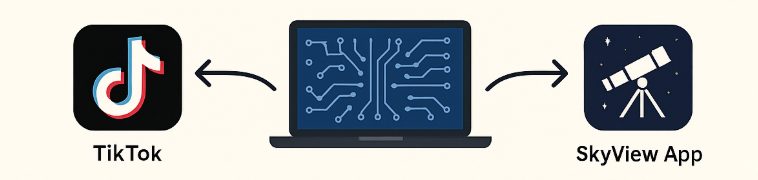
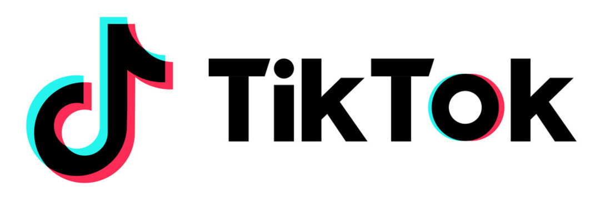
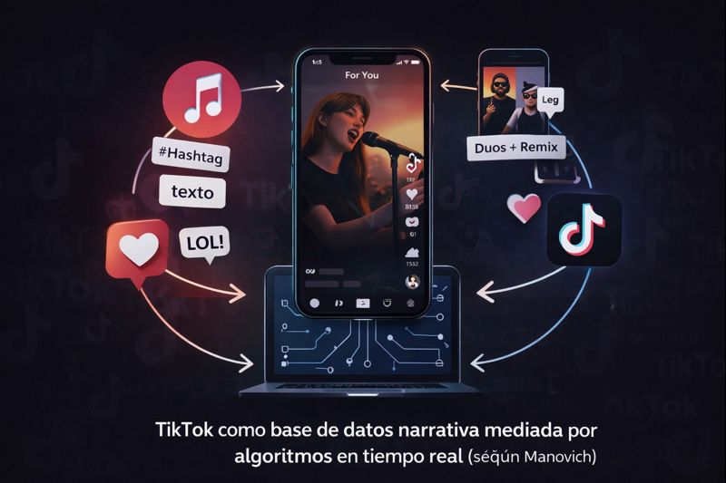
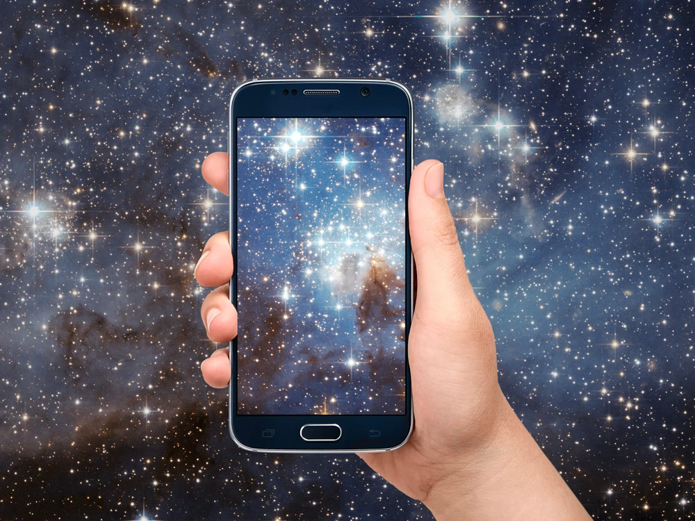
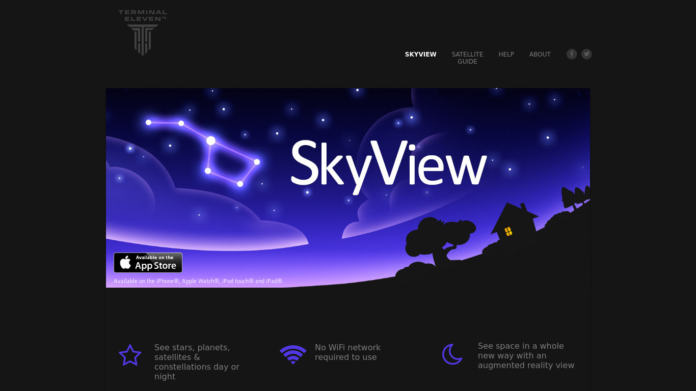

# PEC3 – Visionando el futuro con las gafas de Manovich 
## Recurso de aprendizaje de Cultura Digital

**Autor:** Diego García

**Asignatura:** Cultura Digital

**Actividad:** PEC 3

---

## Planteamiento

En *El software toma el mando*, Manovich comenta que el software además de intervenir en los nuevos medios, se convierte en el **principio estructurante de la cultura digital**, lo cual hace que ya no existan medios aislados, sino **ecosistemas híbridos**, donde la imagen, el texto, la interacción entre los diferentes sistemas y algoritmos se fusionan;

«Las propiedades y técnicas exclusivas de distintos medios se han convertido en elementos de software que pueden combinarse por vías que antes resultaban imposibles».
-Lev Manovich

El presente ensayo propone dos casos de hibridación **recientes y no analizados en el libro**, que ilustran cómo el software redefine formatos, sentidos y experiencias: **TikTok** y **SkyView App**. Ambos ejemplos corroboran que el software reconfigura la cultura y sobre todo, la percepción de la realidad.

---

## Re-descubriendo la hibridacion: Caso 1. TikTok

TikTok es formalmente conocido por ser una plataforma de vídeos de origen chino, con una implantación polémica en Estados Unidos, no así en Europa. Pero en realidad es mucho más que una plataforma de vídeos, si no que es un medio híbrido que combina:

- **Lenguajes visuales y sonoros** (vídeo + música).  
- **Códigos textuales** (subtítulos y hashtags).  
- **Interacción social** (likes, comentarios, remixes...).  
- **Algoritmos de recomendación** que generan nuevas narrativas.

 

Desde la perspectiva de Manovich, TikTok no representa una colección de contenidos (videos), sino una **base de datos narrativa**, donde la experiencia del usuario se genera mediante algoritmos
en tiempo real. El orden y sentido de los contenidos no está predefinido, sino calculado intantáneamente según los patrones de consumo del usuario, intereses y mediciones de engagement. Es decir, estas métricas midan cuanto participan los usuarios, no solamente si están viendo el contenido.

TikTok por tanto es un claro ejemplo de la **fusión de medios clásicos y digitales**: La música se divide en partes, los vídeos se consumen en pequeños trozos y las historias ya no siguen un orden fijo; y el usuario, simultáneamente es espectador y también el creador. 
Las funciones de *duo* o *remix* convierten cada vídeo en un sistema reutilizable para procesos colaborativos, similar a cómo en software open source los módulos de código se comparten y reutilizan en repositorios comunitarios, al estilo de GitHub.

Si lo analizamos con más calma, TikTok también supone un cambio importante en la forma en que utilizzamos el tiempo y la atención en los medios digitales. Frente a otros formatos tradicionales como el cine o la televisión, actualmente desfasados, donde el espectador se adapta al ritmo de la película o del programa de TV, aquí es el contenido el que se adapta constantemente al usuario. El software es el que decide la duración, el orden y el número de repeticiones, optimizando cada segundo para intentar maximizar el tiempo que pasamos mirando la pantalla.

Este fenómeno conecta directamente con una de las ideas centrales de Manovich: el software no solo organiza los contenidos, sino que modela comportamientos culturales. En TikTok, el gesto físico de deslizar el dedo se convierte en una parte esencial de la experiencia. La interfaz y los algoritmos forman un sistema híbrido donde ya no se puede separar claramente tecnología y cultura, de hecho están fusionados.

Además, TikTok no funciona igual para todos los usuarios. Cada feed es único, lo que refuerza la idea de que el medio ya no es un objeto fijo, sino un proceso dinámico. En este sentido, TikTok no indica "per se" cultura, sino que la genera en tiempo real a partir de todos los datos, estadísticas y patrones de uso recabados anteriormente.

Por todo ello, TikTok encajaría perfectamente en una segunda edición de El software toma el mando. No solo como una red social de moda, sino como un ejemplo claro de cómo el software ha pasado a ser el auténtico protagonista de la experiencia cultural digital actual.

Basado en mi propia experiencia personal, TikTok es un ejemplo de modelo híbrido porque transforma los vídeos cortos con audio en otro proceso de creación colectiva, basada en la mezcla, reutiliación  de elementos y difusión masiva debido a los algoritmos.

---

## Re-descubriendo la hibridacion: Caso 2. SkyView App

SkyView App es una aplicación de realidad aumentada que permite **explorar el cielo nocturno superponiendo datos astronómicos sobre imágenes reales captadas por el dispositivo**. En este caso, la hibridación explicasda por Manovich ocurre entre:

- El mundo físico (el cielo real).  
- La base de datos astronómica (planetas, estrellas, constelaciones).  
- La visualización interactiva gracias sensores del dispositivo (cámara, GPS y giroscopio).  
- Interfaces intuitivas de usuario.

Aquí, el software hace de mediador entre espectador y realidad: la cámara del dispositivo no solo captura, sino que **transforma visualmente el cielo en un mapa interactivo** donde los distintos elementos del firmamento adquieren nombres, etiquetas y rutas. Éstas rutas te llevan de un elemento del cielo a otro, donde se enlazan para una mejor localización y comprensión 

Desde la óptica de Manovich, SkyView supera la simple visualización digital: es un medio híbrido donde la realidad física y la representación científica del mapa del cielo se unenn. No se trata de un mapa fijo, como si fuera un atlas mundial, sino de un **espacio aumentado** donde el usuario navega y aprende a partir de una **interfaz interactiva basada en datos**.

Además este tipo de hibridación modifica la percepción del espacio y aumenta su conocimiento ya que integra los sensores físicos propioos de los teléfonos móviles con bases de datos y la visualización digital. Por tanto este software crea una experiencia que modifica la forma en que habitualmente entendemos, conocemos y nos relacionamos con el espacio.

Personalmente soy moderadamente aficionado a la astronomía, y durante muchos años, ocasionalmente, he utilizado telescopios y mapas astronómicos para observar el cielo. Garantizo que Skyview ha aumentado mi (siempre pequeño) conocimiento del firmamento y ha modificado drásticamente la frecuencia con la que observaba el cielo. Definitivamente ha cambiado la forma en la que me relaciono con el espacio.

Si se analiza con más detalle, SkyView App también es un ejempo de  cómo el software puede transformar el conocimiento de una experiencia accesible y cotidiana. Tradicionalmente, la astronomía ha estado vinculada a libros demasiado técnicos, mapas complejos de leer o instrumentos específicos que requerían un aprendizaje profundo previo. A diferencia de ello, SkyView cambia toda esa complejidad a un lenguaje más visual e interactivo, apoyándose en interfaces sencillas y en la inmediatez de los dispositivos móviles.

Desde la perspectiva de Manovich, este proceso puede entenderse como un caso claro de transcodificación cultural, donde el saber científico se adapta al software junto al diseño de interfaces de Apps actuales. El cielo deja de ser un espacio abstracto  y muy distante, complejo de entender para convertirse en un entorno mágico, navegable, lúdico, en el que el usuario aprende explorando sin necesidad de mapas u objetos complejos. El conocimiento ya no es recibido de forma pasiva, sino que se construye a partir de la interacción directa con el entorno físico, siendo aumentado por capas digitales.

Otro aspecto interesante es que SkyView no impone un modelo fijo, si no que  cada usuario genera su propia experiencia en función de hacia dónde apunta el dispositivo, del momento del día o del lugar en el que se encuentra. Esto refuerza la idea de que el medio no es un objeto cerrado, sino un sistema dinámico que responde al contexto del dispositivo y sobre todo, a las acciones del usuario. El software, en este sentido, actúa como intermediario entre el mundo real y la información digital, reorganizando ambos en tiempo real.

Por todo ello, SkyView App puede considerarse un ejemplo muy claro de hibridación moderna, donde realidad, datos, interfaz y cuerpo se integran en una única experiencia. Su funcionamiento confirma la tesis de Manovich de que el software no solo representa el mundo, sino que redefine nuestra forma de percibirlo, entenderlo y relacionarnos con él en la vida cotidiana.

---

## Recursos y enlaces

- https://www.tiktok.com  
- https://play.google.com/store/apps/details?id=com.t11.skyviewfree&hl=en&pli=1
- Manovich, L. *El software toma el mando*  
